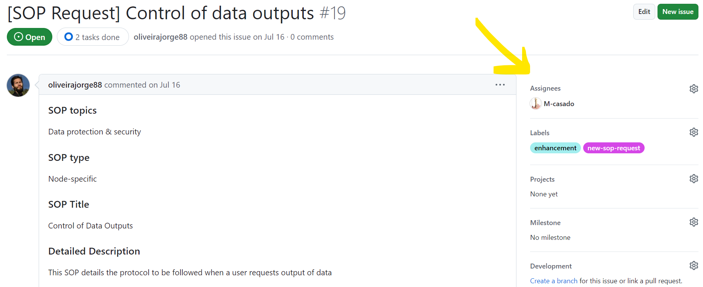
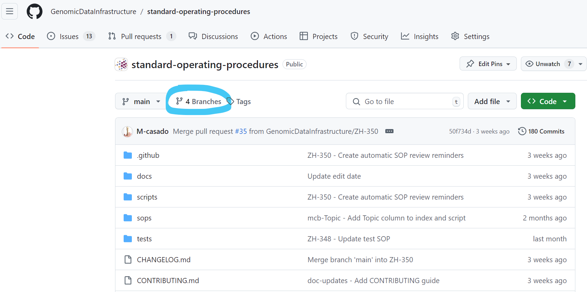
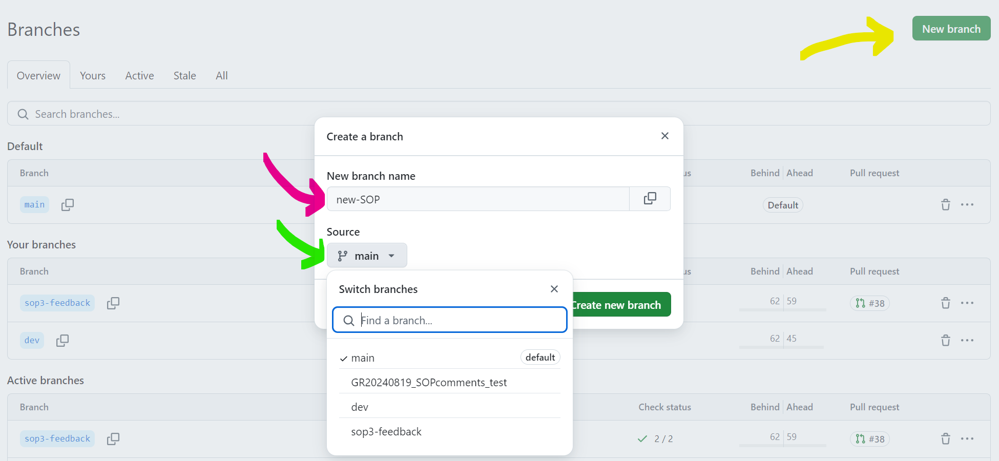
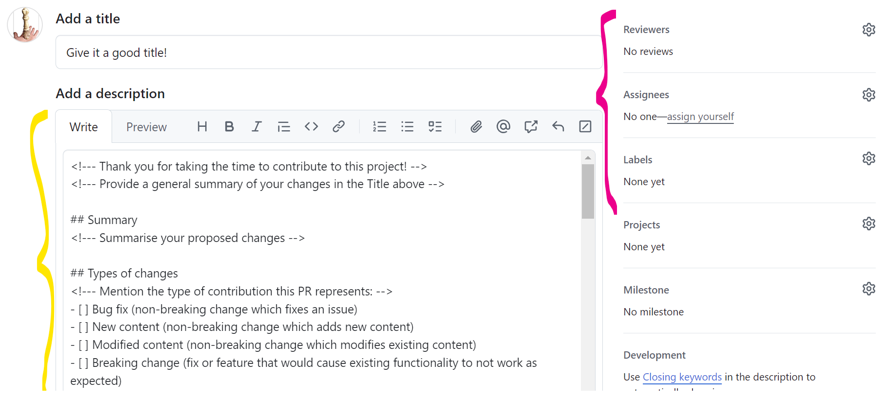
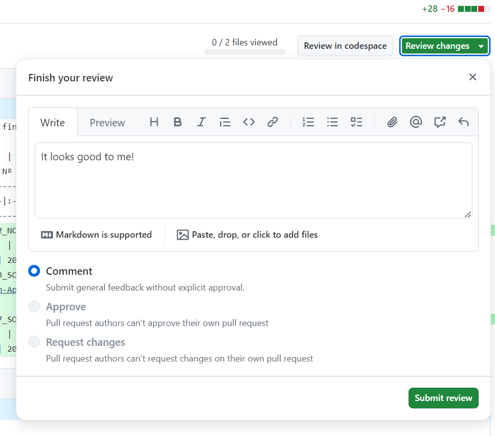

# Introduction to GitHub for GDI SOP Maintainers

This guide is designed to **help maintainers** (see [ORR](../docs/GDI-SOP_organisational-roles-and-responsibilities.md)) of the [Genomic Data Infrastructure (GDI) SOP Repository](https://github.com/GenomicDataInfrastructure/standard-operating-procedures) understand and navigate the **basic functionalities of GitHub**. It covers the essentials of creating and managing pull requests, handling issues, working with branches, and using GitHub workflows within the context of SOP maintenance.

It is worth noting that this guide is a fraction of the incredibly detailed (and much better written) [**official GitHub documentation**](https://docs.github.com/en/get-started). This guide of ours is specifically targeted to this repository and covers the bare minimum.

## Index
1. [What is GitHub?](#what-is-github)
2. [Understanding the Repository](#understanding-the-repository)
3. [Issues](#issues)
4. [Branches](#branches)
5. [Pull Requests (PRs)](#pull-requests)
6. [Workflows and Linting](#workflows-and-linting)
7. [General Recommendations](#general-recommendations)
8. [Further Reading](#further-reading)

## What is GitHub?

GitHub is a cloud-based platform that allows for **collaborative development of projects through version control**. For this repository, GitHub allows multiple maintainers and contributors to work on the **Standard Operating Procedures (SOPs)** simultaneously, ensuring that changes are tracked and reviewed before they are added to the ``main`` branch. Each repository is made up of a combination of code files, documentation, and workflows that automate certain actions (e.g., verifying formatting of SOPs).

If you are familiar with Google Drive, OneDrive or DropBox, you can think of GitHub as a similar platform. Even though the differences are notable, for the purpose of the introduction we can imagine that when you modify a GitHub repository, you are modifying a directory (i.e., a folder) that is shared with contributors through the internet. We will see promptly what are the features of GitHub on top of simply being a place where we store files.

### Key GitHub Concepts:
- **Repository** (_blue_):  A directory containing project files. In this case, the GDI SOP repository stores the SOPs and associated metadata.
- **Branch** (_yellow_): A separate version of the repository where you can work on changes without affecting the main codebase (also known as ``main`` branch).
- **Commit** (_orange_): A record of changes made to files. As the name implies, when you "commit" any change to a file, you are committing to those changes in the branch where you are at while you make them.
- **Pull Request (PR)** (_pink_): A request to merge changes from one branch to another.
- **Issue** (_green_): A way to track tasks, improvements, or bugs in the repository.


We will elaborate these key concepts further in the sections below. 

### Example of GitHub usage
See in the diagram below a simple example of how we envision changes are propagated through the branches of this repository.

From left to right:
- We created the GDI SOP repository (``main`` branch)
- Added new changes (e.g., documentation files)
- Then we decided to create a new branch (named ``dev``) that would hold 'new features' until we decided they were ready to be part of the ``main`` branch.
- We added some changes, one of which was scheduled to be a new SOP. For this reason, we created yet a new branch, named ``new-SOP``.
- After adding the new SOP and reviewing it, we decided that it was ready to be merged along the "other new features" inside the ``dev`` branch.
- We continued working on ``dev`` (e.g., added new documents, new SOPs, modified some content...). Take note that up to this point, the ``main`` branch was unaltered, and thus it is as if the repository was never changed to the public.
- After a while, we decided that the new changes in ``dev`` (including our "new SOP") were ready to be part of the "public-facing branch", and thus we merged ``dev`` into ``main``. 
````mermaid
gitGraph
    commit id: "Initial project"
    commit id: "New changes"
    branch dev
    checkout dev
    commit id: "Create 'dev' branch"
    commit id: "More changes"
    branch new-SOP
    checkout new-SOP
    commit id: "Create new branch"
    commit id: "Add new SOP"
    commit id: "Revise new SOP"
    checkout dev
    merge new-SOP id: "Merge new SOP into dev"
    commit id: "Continue work on dev"
    checkout main
    merge dev id: "Merge dev into main"
    commit id: " "
````

## Understanding the Repository

This repository has a specific folder and file structure, including:
- **`/docs/`**: Contains documentation files, including this guide.
- **`/sops/`**: Contains the Standard Operating Procedures (SOPs).
- **`/scripts/`**: Contains python scripts that are used in workflows to automate certain processes. These scripts are called from elsewhere, either manually or automatically, to ease some tasks.
- **`/.github/`**: Contains bits that you could consider part of the "settings" of the repository, like Pull Request and Issue templates, as well as workflows.
- **`README.md`**: The main landing page for the repository, explaining its purpose. There may be multiple other ``README.md`` files in other folders, which are rendered by GitHub as soon as you enter a directory.

Refer to the [**GDI-SOP charter**](../docs/GDI-SOP_charter.md) for more on the structure and purpose of this GDI repository.

Refer to the [**SOP accessioning guide**](../docs/GDI-SOP_sop-accessioning.md) for more details on how files in this repo are named and organised.

## Issues

Issues are used to track tasks, requests, or bugs. When you (or anyone) creates an issue in the repository, it automatically gets added to the [**ZenHub board**](https://app.zenhub.com/workspaces/t43-gdi-sops-667c1c5532726a00b93d51e4/board) used by GDI for project management.

You can find more details about GitHub issues at their [**GitHub Issues documentation**](https://docs.github.com/en/issues).

### Creating an Issue
1. Navigate to the **Issues** tab at the top of the repository.
2. Click on [**New Issue**](https://github.com/GenomicDataInfrastructure/standard-operating-procedures/issues/new/choose).
3. Select the appropriate template (e.g., "New SOP Request").
4. Fill in the necessary details and submit.


Make sure to assign relevant labels, milestones, and the person responsible. 



The issue will now appear in the issues list and the ZenHub board.

## Branches

Branches allow you to **work on changes without affecting the ``main`` branch**. When you create a branch, you are effectively creating a "copy" of the content of the repository. You can modify this copy freely without affecting anyone (unless you merge it to any other branch!).

Find more details at [**GitHub's official documentation about branches**](https://docs.github.com/en/pull-requests/collaborating-with-pull-requests/proposing-changes-to-your-work-with-pull-requests/about-branches).

### Main Branches in the Repository
- **`main`**: The primary branch, representing the most stable version of the repository. This branch is what everyone sees when they land on the repository.
- **`dev`**: A branch where new features and changes are tested before being merged into `main`.

### Creating a New Branch
1. Navigate to the **Code** tab.
2. Click the "Branches" button.

3. Click "New branch", provide the new branch a name and select the source. The source is very relevant, since it will be what you are effectively "copying" into your new branch. It could be that you want to start off from ``main`` but maybe you want to copy ``dev`` (or any other branch) instead.


### Best Practices
- 🚨 Never commit directly to the `main` branch 🚨. Committing this way happens when you are in the ``main`` branch, you change anything, and commit these changes to that same branch.
  - As a rule of thumb, except if you know exactly what you are doing (and sometimes even then), never commit any change to ``main``. Please don't.
  - You may break things you are unaware of, and you would be bypassing all checks that are in place for Pull requests and versions.
  - How to avoid it? Just create a different branch to add your changes to.
- Generally, when you create a new branch, use the `dev` branch as source.
- Keep branch names clear, short and informative (e.g., `ZH-301`, or `diagram-quickfix` - not `my-branch` or `123`).

## Pull Requests

**Pull Requests** (PRs) are used to **propose changes from one branch to another**. They ensure that changes are reviewed before being added to the repository. Coming back to the Google Drive analogy, when you enter the "suggestion mode", and change something in a document, what you are effectively doing is something similar to a PR, that later the author of that Google Document approves. Similarly, but way more detailed, is how GitHub PRs work.

Refer to [**GitHub's official documentation on Pull Requests**](https://docs.github.com/en/pull-requests/collaborating-with-pull-requests/proposing-changes-to-your-work-with-pull-requests/about-pull-requests) for all details.

### Creating a Pull Request
1. Once you have finished your changes on a branch, go to the **Pull Requests** tab.
2. Click **New Pull Request**.

3. Select the branch you want to merge from (e.g., ``sop3-feedback``) and the branch you want to merge into (likely `dev`) and click on "Create pull request".

4. The description will be prefilled by the PR template: fill it out to provide useful information for your PR.
5. Assign reviewers, labels, and pertinent labels.

6. Click "Create pull request".

### Reviewing a Pull Request
It is likely that you are appointed as a reviewer at some point of a PR in the repository. 

Please refer to the [**official GitHub documentation about Pull Request reviews**](https://docs.github.com/en/pull-requests/collaborating-with-pull-requests/reviewing-changes-in-pull-requests/about-pull-request-reviews) for all details. Below will go over the minimum steps:

1. Navigate to the **Pull Requests** tab and select the PR you want to review.
2. Once inside the PR, you can see the conversation tab with all previous comments, the description of the PR, etc.
3. To review the changes in detail, you can go to "**Files changed**" tab (_yellow_), where you will find every changed file listed. The view of each file is split in 2: on the left what was; on the right was is proposed to be. Changes between the two states of the file are highlighted for convenience.
4. At each line of the file you can click on the ``+`` symbol to **leave directed comments**. Click on "Start a review" and add as many comments as needed.

5. Once you have reviewed the whole set of changes, click on the "**Review changes**" button, where you will be able to choose between adding a simple comment, approving the PR, or requesting more changes.


For **more details on the reviewing process**, refer to the [**review checklist**](../docs/GDI-SOP_review-checklist.md).

### General Recommendations

- **Do not push directly to `main`**: Always use a PR to propose changes.
- **Check PR origin**: Review who submitted the PR and ensure it follows repository guidelines before merging.
- **Ensure workflow checks pass**: Before merging a PR, ensure that all GitHub Actions workflows have passed (e.g., linting).
- **Clear commit messages**: Use descriptive commit messages to help maintain a clean history (e.g., `ZH-301 - Fix SOP typo in section 2.3`).

## Workflows and Linting

GitHub Workflows, also known as GitHub Actions, help automate certain actions in the repository. In the GDI SOP repository, workflows are used, for example, to ensure SOPs follow proper formatting and style guidelines before merging them.

You can find an extensive documentation about GitHub workflows in the official [**GitHub actions documentation**](https://docs.github.com/en/actions/writing-workflows/quickstart).

You can **find the workflow configurations of this repository** in the [`.github/workflows/`](../.github/workflows/) directory, and the scripts they run in the [`scripts/`](../scripts/) folder. To learn more about each specific workflow, see the description at the top of the corresponding workflow file in `.github/workflows/`.